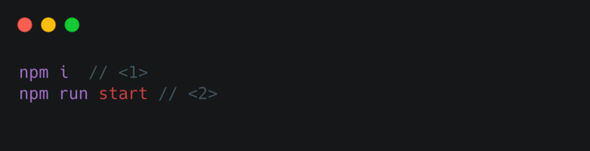

:source-highlighter: rouge

== introduction
this is a React demo project mainly to demonstrate
``react dom`` works logic.

== mainly feature
. render jsx file
. render class component
. render function component

== local development

[source, bash]
----
npm i  // <1>
npm run start // <2>
----
<1> install the dependency
<2> start local development

then you can start local development :)

